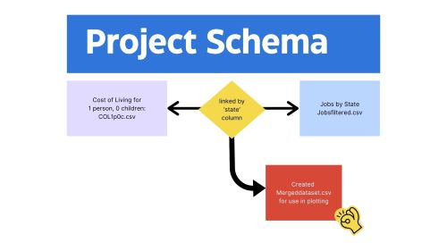

# Job Income By State Analysis

2023 Cost of Living and Job Data Analysis:

Affordability Insights for Individuals Across U.S. States

## Overview
This project focuses on the cost of living across U.S. states, emphasizing job data for individuals. It provides insights into affordability by comparing the general income levels of various jobs within each state against the average cost of living.

The goal of this project is to help individuals identify which states offer the best financial rewards for their skills and vocations, thereby aiding them in making informed decisions about where to live and work.

The project aims to address the rapidly increasing cost of living and highlight the proportionality of job incomes to living costs. Results will be visualized in a heat map of the United States, showcasing which areas or states offer better affordability for individuals.

## Instructions

1. Clone the repo to your machine.
2. Create a virtual environment and install the packages listed in the 
`requirements.txt` file (instructions below).
3. Open and run "JobPayMap.py" by typing "python JobPayMap.py"
4. OR Select your job category and view results on Tableau public [here](https://public.tableau.com/app/profile/laura.terry3599/viz/ResidualIncomeMap/Story2?publish=yes)

### Virtual Environment Commands
| Command    | Linux/Mac                          | GitBash/Windows                   |
|------------|------------------------------------|-----------------------------------|
| Create     | `python3 -m venv venv`          | `python -m venv venv`           |
| Activate   | `source venv/bin/activate`       | `source venv/Scripts/activate`    |
| Install    | `pip install -r requirements.txt`  | `pip install -r requirements.txt` |
| Deactivate | `deactivate`                       | `deactivate`                      |

## Data Interpretation and Goals
This project aims to visualize the states where various jobs are most lucrative by creating a heatmap. The data was collected from two sources: the 2023 Cost of Living dataset and the 2023 Job Income data from the Bureau of Labor Statistics.

### Cost of Living Analysis:

1. Averaged the cost of living by state using data for a single person with no children.
Combined city and county information to derive a state average.

2. Job Income Analysis: Identified 22 common vocational categories from the Job Income dataset.
Calculated the average income for each vocation by state.

3. Data Integration: Merged the two datasets to create a comprehensive list that includes the average cost of living by state, the average income by vocation in each state, and the net difference, termed as "Residual Income". This is NOT to be considered disposable income by any means, only showing how much money on average was leftover yearly after the average cost of living for each state.

4. Visualization: The project offers two visualization options. One uses Matplotlib and GeoPandas in Python to create a choropleth map based on user selections. The other is a Tableau choropleth map illustrating Residual Income by state. Both visualizations employ a red-yellow-green color scale, with green representing the highest residual income.

## Data Sources:
Job data sources: https://www.bls.gov/oes/special-requests/oesm23nat.zip

Cost of living data source: https://www.kaggle.com/datasets/asaniczka/us-cost-of-living-dataset-3171-counties

